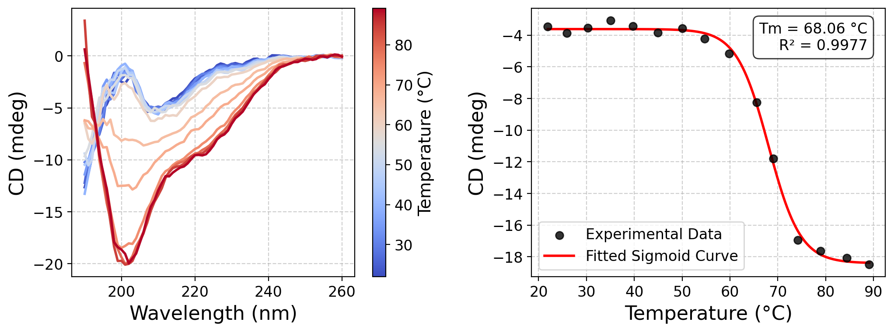

# cd-analysis-tool
## Introduction


A Python toolkit for analyzing protein thermal denaturation data from Chirascan™ instruments.

Core Features:

- Parse Binary Files: Reads and interprets proprietary binary data files generated by Chirascan™ software.

- Analyze Thermal Melts: Processes variable-temperature Circular Dichroism (CD) data.

- Calculate Melting Temperature (Tm): Automatically fits experimental data to a sigmoidal model to determine the protein's melting temperature (Tm).

## Installation

`pip install cd-analyzer`

## Usage
```
from cdanalyzer import analysis
import matplotlib.pyplot as plt

path = 'your_path contained dsx file' 
# buffer.dsx file: substrate buffer background.
data = analysis.help_read_multifile(path)
fig,axs = plt.subplots(1,2,figsize=(12,4),dpi=200)
plt.subplots_adjust(wspace=0.3)
analysis.plot_dtemp_cd(ax=axs[0],data=data[1:,:],temp_lst=data[0,1:],smooth=5)
analysis.tm_calc_cd(data=data[1:-10,:],temp_lst=data[0,1:],wavelength='205',ax=axs[1])
plt.show()
```

